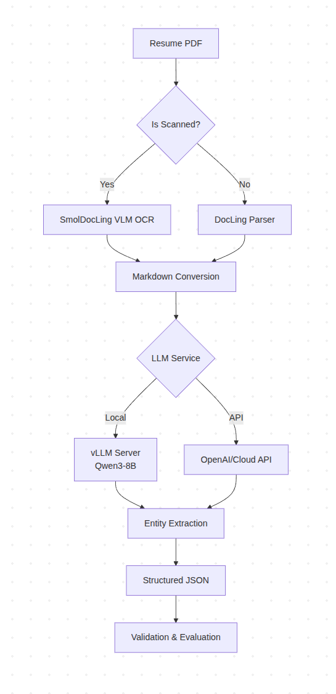

# Resume Parser with DocLing and LLM

A comprehensive resume parsing system that combines **DocLing** for document parsing, **SmolDocLing** for OCR on scanned documents, and **LLM** for information extraction. Supports both **local VLM models** and **API key services** for flexible deployment.

## 🚀 Features

- **Format Support**: PDF files
- **OCR Capability**: Handles scanned documents using SmolDocLing VLM
- **Flexible LLM Integration**: Local models (vLLM) or cloud APIs (OpenAI, etc.)
- **Structured Extraction**: Name, email, phone, skills, education, experience, certifications
- **Evaluation Framework**: Comprehensive metrics and ground truth validation
- **API Server**: FastAPI-based REST API for production deployment

## ��️ Architecture



The workflow below illustrates the end-to-end resume extraction pipeline, from document ingestion (PDF, DOCX, scanned images) through OCR (if needed), document parsing, LLM-based information extraction, and outputting structured JSON results. This modular design enables flexible integration of local or cloud-based models and supports both batch and API-based processing.

## 🛠️ Tech Stack

- **Document Processing**: DocLing, SmolDocLing VLM
- **LLM Services**: vLLM (local), OpenAI API, Anthropic Claude
- **OCR**: SmolDocLing Vision-Language Model
- **API Framework**: FastAPI, Uvicorn
- **Evaluation**: Fuzzy matching, Precision/Recall metrics
- **Languages**: Python 3.10+

## 📁 Project Structure

```
Resume-extraction/
├── src/                           # Main source code
│   ├── core/                      # Core processing modules
│   │   ├── config.py             # Configuration management
│   │   ├── client.py             # LLM and OCR clients
│   │   ├── document_processor.py # PDF processing pipeline
│   │   └── prompts.py            # LLM prompt templates
│   ├── api/                      # API server components
│   │   ├── resume_extraction_server.py # FastAPI server
│   │   └── vllm_server.py        # vLLM server management
│   ├── demo/                     # Demo and testing
│   │   └── pdf_inference_demo.py # PDF processing demo
│   ├── datasets/                 # Dataset processing tools
│   │   ├── dataset.py            # PDF analysis and classification
│   │   ├── convert_to_scanned.py # PDF to scanned conversion
│   │   ├── convert_sample.py     # Sample conversion utility
│   │   └── monitor_conversion.py # Conversion progress monitoring
│   ├── evaluate/                 # Evaluation framework
│   │   ├── run_evaluation.py     # Main evaluation pipeline
│   │   ├── evaluate.py           # Basic evaluation metrics
│   │   ├── comprehensive_eval.py # Advanced evaluation with confidence intervals
│   │   ├── create_gt.py          # Ground truth creation from CSV
│   │   ├── summary.py            # Evaluation summary reports
│   │   └── manage_results.py     # Results management utilities
│   ├── scripts/                  # Utility scripts
│   │   ├── run_demo.sh           # Demo execution script
│   │   ├── run_tests.sh          # Test execution script
│   │   ├── start_resume_server.sh # API server startup
│   │   └── start_vllm_server.sh  # vLLM server startup
│   └── tests/                    # Test suites
│       ├── test_pdf_resume_extraction.py # PDF processing tests
│       ├── test_llm_client.py    # LLM client tests
│       └── test_setup.py         # Environment setup tests
├── data/                         # Data directories
│   ├── GT/                       # Ground truth files (ID_gt.json)
│   ├── INFORMATION-TECHNOLOGY/   # Original PDF dataset
│   ├── Resume/                   # CSV data with resume information
│   └── SCAN-INFORMATION-TECHNOLOGY/ # Converted scanned PDFs
├── results/                      # Evaluation results
├── outputs/                      # Processing outputs
├── assets/                       # Sample files and documentation
└── requirements.txt              # Python dependencies
```

## 🚀 Quick Start

### Prerequisites

```bash
# Python 3.10+ with pip
python3 --version

# CUDA support (for GPU acceleration)
nvidia-smi

# Git
git --version
```

### Installation

```bash
# Clone the repository
git clone <repository-url>
cd Resume-extraction

# Create virtual environment
python3 -m venv resume_extraction
source resume_extraction/bin/activate  # Linux/Mac
# or
resume_extraction\Scripts\activate     # Windows

# Install dependencies
pip install -r requirements.txt
```

### Configuration

Create a `.env` file in the project root:

```bash
# LLM Configuration (Choose one)
# Option 1: Local vLLM (Recommended for Production)
LLM_BASE_URL=http://localhost:8000/v1
LLM_MODEL=Qwen/Qwen3-8B
LLM_API_KEY=

# Option 2: OpenAI API (Easy Setup)
LLM_BASE_URL=https://api.openai.com/v1
LLM_MODEL=gpt-4o-mini
LLM_API_KEY=sk-your-key-here

# Option 3: Anthropic Claude (High Quality)
LLM_BASE_URL=https://api.anthropic.com/v1
LLM_MODEL=claude-3-5-sonnet-20241022
LLM_API_KEY=sk-ant-your-key-here

# DocLing Configuration
DOCLING_USE_OCR=true

# Server Configuration
HOST=0.0.0.0
PORT=8001
```

## 🧪 Usage Examples

### 1. Web Interface (Gradio Demo)

```bash
# Launch the web interface
bash src/scripts/run_gradio_demo.sh

# Then open your browser to: http://localhost:7860
```

Features:
- 📄 Upload PDF resumes
- ⚙️ Configure API settings (URL, API key, model)
- 👁️ Toggle OCR for scanned documents
- 📋 View extracted information
- 📥 Download JSON results

### 2. PDF Processing Demo

```bash
# Single file processing
python3 src/demo/pdf_inference_demo.py assets/resume.pdf -o output/result.json

# Batch processing
python3 src/demo/pdf_inference_demo.py data/INFORMATION-TECHNOLOGY -o output/batch_results

# With custom output
python3 src/demo/pdf_inference_demo.py assets/resume.pdf -o output/custom_result.json
```

### 2. Dataset Analysis

```bash
# Analyze PDF readability
python3 src/datasets/dataset.py

# Convert readable PDFs to scanned
python3 src/datasets/convert_to_scanned.py

# Monitor conversion progress
python3 src/datasets/monitor_conversion.py
```

### 3. Evaluation Pipeline

```bash
# Run complete evaluation
python3 src/evaluate/run_evaluation.py --csv-path data/Resume/Resume.csv --outputs-dir outputs --mode custom

# Standard evaluation
python3 src/evaluate/run_evaluation.py --mode standard

# Comprehensive evaluation
python3 src/evaluate/comprehensive_eval.py

# Quick summary
python3 src/evaluate/summary.py
```

### 4. API Server

```bash
# Start resume extraction server
bash src/scripts/start_resume_server.sh

# Start vLLM server (if using local LLM)
bash src/scripts/start_vllm_server.sh --gpus 2 --model Qwen/Qwen3-8B
```

### 5. Testing

```bash
# Run all tests
bash src/scripts/run_tests.sh

# Run specific test
python3 src/tests/test_pdf_resume_extraction.py
```

## 📊 Evaluation Results

### Current Performance (Latest Run)

- **Overall Accuracy**: 36.6%
- **Files Evaluated**: 6/6
- **Performance Breakdown**:
  - Excellent (≥80%): 0 files
  - Good (60-79%): 0 files
  - Fair (40-59%): 1 files
  - Poor (<40%): 5 files

### Field Performance

- ✅ **Email**: 100.0%
- ✅ **Phone**: 100.0%
- ⚠️ **Languages**: 66.7%
- ❌ **Education**: 16.7%
- ❌ **Experience**: 9.7%
- ❌ **Name**: 0.0%
- ❌ **Skills**: 0.0%
- ❌ **Certifications**: 0.0%

### Key Findings

- Overall accuracy below 50% - significant improvements needed
- Email and phone extraction working well
- Name, skills, and certifications need specialized extraction
- Education and experience require better parsing logic

## 🔧 Configuration Details

### LLM Configuration Options

#### Local vLLM (Recommended for Production)
```bash
# Start vLLM server
bash src/scripts/start_vllm_server.sh --gpus 2 --model Qwen/Qwen3-8B

# Environment variables
LLM_BASE_URL=http://localhost:8000/v1
LLM_MODEL=Qwen/Qwen3-8B
LLM_API_KEY=
```

#### OpenAI API (Easy Setup)
```bash
# Environment variables
LLM_BASE_URL=https://api.openai.com/v1
LLM_MODEL=gpt-4o-mini
LLM_API_KEY=sk-your-key-here
```

#### Anthropic Claude (High Quality)
```bash
# Environment variables
LLM_BASE_URL=https://api.anthropic.com/v1
LLM_MODEL=claude-3-5-sonnet-20241022
LLM_API_KEY=sk-ant-your-key-here
```

### DocLing Configuration

```bash
# Enable/disable OCR
DOCLING_USE_OCR=true  # or false

# SmolDocLing model (for OCR)
SMOLDOCLING_MODEL=ds4sd/SmolDocling-256M-preview
```

## 📈 Evaluation Framework

### Metrics Used

1. **Entity-Level Accuracy**: Fuzzy matching for strings
2. **List-Level Metrics**: Precision, recall, F1-score for lists
3. **Complex Entity Evaluation**: Structured data comparison
4. **Confidence Intervals**: Statistical analysis with bootstrapping
5. **Performance Tiers**: Excellent (≥80%), Good (60-79%), Fair (40-59%), Poor (<40%)

### Ground Truth Creation

```bash
# Create ground truth from CSV
python3 src/evaluate/create_gt.py

# Individual ground truth files
# Format: data/GT/{ID}_gt.json
```

### Evaluation Pipeline

```bash
# Complete pipeline
python3 src/evaluate/run_evaluation.py --csv-path data/Resume/Resume.csv --outputs-dir outputs --mode custom

# Steps:
# 1. Create ground truth from CSV
# 2. Evaluate outputs against ground truth
# 3. Generate comprehensive metrics
# 4. Save results to results/ directory
```

## 🧪 Testing

### Test Suites

```bash
# PDF processing tests
python3 src/tests/test_pdf_resume_extraction.py

# LLM client tests
python3 src/tests/test_llm_client.py

# Environment setup tests
python3 src/tests/test_setup.py

# Run all tests
bash src/scripts/run_tests.sh
```

### Test Coverage

- ✅ PDF text extraction
- ✅ Markdown conversion
- ✅ Entity extraction
- ✅ LLM client functionality
- ✅ Environment configuration
- ✅ API server functionality

## 🚀 Deployment

### Production Setup

1. **Environment Configuration**
   ```bash
   # Set production environment variables
   export LLM_BASE_URL=http://localhost:8000/v1
   export LLM_MODEL=Qwen/Qwen3-8B
   export DOCLING_USE_OCR=true
   ```

2. **Start vLLM Server**
   ```bash
   bash src/scripts/start_vllm_server.sh --gpus 1 --model Qwen/Qwen3-8B
   ```

3. **Start API Server**
   ```bash
   bash src/scripts/start_resume_server.sh 8001
   ```

4. **Health Check**
   ```bash
   curl http://localhost:8001/health
   ```


## 🔍 Troubleshooting

### Common Issues

1. **LLM Client Not Available**
   ```bash
   # Check vLLM server
   curl http://localhost:8000/v1/models
   
   # Check environment variables
   echo $LLM_BASE_URL
   echo $LLM_MODEL
   ```

2. **GPU Memory Issues**
   ```bash
   # Set CUDA device order
   export CUDA_DEVICE_ORDER=PCI_BUS_ID
   
   # Use specific GPUs
   export CUDA_VISIBLE_DEVICES=0,1
   ```

3. **Import Errors**
   ```bash
   # Ensure you're in the project root
   cd Resume-extraction
   
   # Check Python path
   python3 -c "import sys; print(sys.path)"
   ```

4. **Evaluation Path Issues**
   ```bash
   # Run from project root
   python3 src/evaluate/run_evaluation.py --csv-path data/Resume/Resume.csv
   ```

### Performance Optimization

1. **GPU Configuration**
   ```bash
   # Use specific GPUs
   export CUDA_VISIBLE_DEVICES=0,1
   
   # Set memory utilization
   export GPU_MEMORY_UTILIZATION=0.8
   ```

2. **Batch Processing**
   ```bash
   # Process multiple files
   python3 src/demo/pdf_inference_demo.py data/INFORMATION-TECHNOLOGY -o output/batch
   ```

3. **Memory Management**
   ```bash
   # Monitor GPU memory
   nvidia-smi
   
   # Clear GPU cache
   python3 -c "import torch; torch.cuda.empty_cache()"
   ```

## 📚 API Documentation

### Endpoints

- `POST /extract` - Extract resume information
- `POST /extract/batch` - Extract from multiple resumes
- `POST /extract/specific` - Extract specific field
- `GET /health` - Health check
- `GET /status` - System status

### Example Usage

```bash
# Extract resume
curl -X POST http://localhost:8001/extract \
  -F "file=@assets/resume.pdf" \
  -F "save_output=true"

# Health check
curl http://localhost:8001/health

# Batch processing
curl -X POST http://localhost:8001/extract/batch \
  -F "files=@resume1.pdf" \
  -F "files=@resume2.pdf"
```

*** Note ***: Replaced the example API URL http://localhost:8001 with a placeholder for your API, as suggested my api: http://42.113.228.247:8001

## 🤝 Contributing

1. Fork the repository
2. Create a feature branch
3. Make your changes
4. Add tests for new functionality
5. Run the test suite
6. Submit a pull request

## 📄 License

This project is licensed under the MIT License - see the LICENSE file for details.

## 🙏 Acknowledgments

- **DocLing**: Document processing and parsing
- **SmolDocLing**: Vision-language model for OCR
- **vLLM**: High-performance LLM serving
- **FastAPI**: Modern web framework for APIs
- **Qwen**: Large language model for text generation

---

**Note**: This project is actively maintained and updated. For the latest features and improvements, please check the repository regularly. 